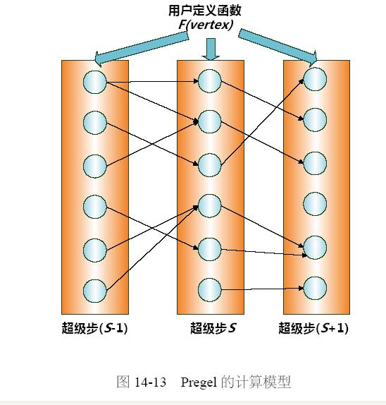

## Pregel 计算模型

Pregel是Google提出的大规模分布式图计算平台，专门用来解决网页链接分析、社交数据挖掘等实际应用中涉及的大规模分布式图计算问题。

Pregel在编程模型上遵循以图节点为中心的模式，在超级步S中。每一个图节点能够汇总从超级步S-1中其它节点传递过来的消息，改变图节点自身的状态。并向其它节点发送消息。这些消息经过同步后。会在超级步S+1中被其它节点接收并做出处理。用户仅仅须要自己定义一个针对图节点的计算函数F(vertex),用来实现上述的图节点计算功能。至于其它的任务，比方任务分配、任务管理、系统容错等都交由Pregel系统来实现。

典型的Pregel计算由图信息输入、图初始化操作，以及由全局同步点分割开的连续运行的超级步组成，最后可将计算结果进行输出。

